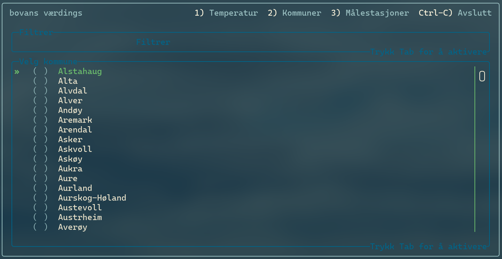
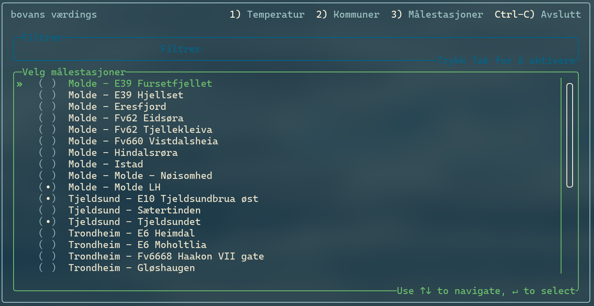
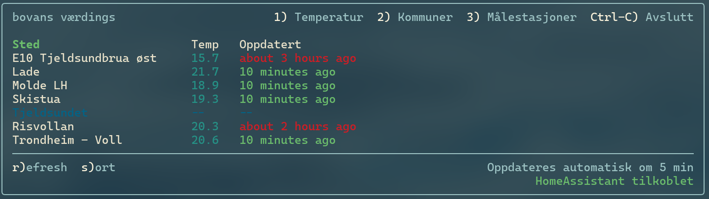

# bovans værdings

A simple CLI app I made because I wanted to use data from Yr.no
(which basically uses frost.met.no) and get it into Home Assistant.

Then I got sidetracked and made a CLI tool that can be used to get weather data
because I found the idea of using React in terminal to be kinda fun.

## Description

### Kommuner (Municipalities)

First one should go to Kommuner and select the municipality you want to get data for.



The app will then fetch the data from frost.met.no and create a database
containing the measuring stations for those municipalities.

### Målestasjoner (Measurement stations)

This enables the selection of a specific measurement station.
Some are updated at a too slow of interval to be useful, so you can select
the ones you want to use.



### Temperatur (Temperature)

After selecting a municipality and a measurement station, you can
retrieve the temperature data for those stations.



## How to run

Install bun if you don't have it already:
[bun.sh](https://bun.sh/)

To install dependencies:

```bash
bun install
```

To add secrets go to [frost.met.no](https://frost.met.no/auth/requestCredentials.html)
and get your secrets.

Put them in a `.env` file in the root of the project:

```config
CLIENT_ID=your_client_id
CLIENT_SECRET=your_client_secret
```

To run:

```bash
bun start
```

## Dev notes

Use `bun dev` to start with the possibility to inspect the code
(Tried to get react-devtools working, but it seems broken after React 19 update)

Use `bun test` to run some tests, they just create the databases
and checks that initializing work. Tests will be added if they make the development
easier, as HMR does not work yet.

This is work in progress and just for fun, so dont rely on it for anything important!
